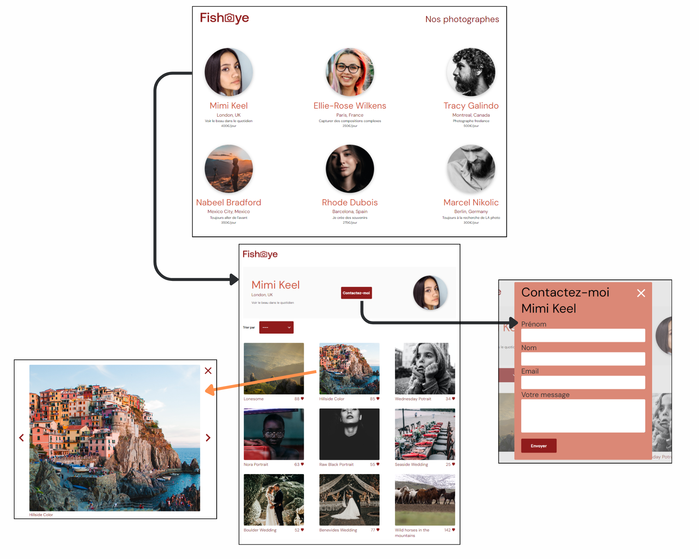
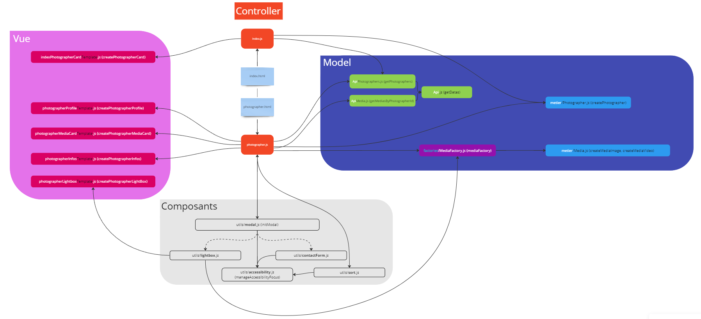

# Fisheye

## Créez un site accessible pour une plateforme de photographes

Projet 6 du parcours "**Développeur d'application** - JavaScript React" d'OpenClassrooms

### 📚 Contexte

En tant que développeuse junior chez Techasite, une société de conseil spécialisée dans le développement de sites web et d'applications mobiles, j'ai eu la mission de réaliser le prototype du site web **Fisheye**.  

FishEye est un site web qui permet aux photographes indépendants de présenter leurs meilleurs travaux.  

La priorité absolue du client est l'**accessibilité du site**.

### 💡 Technologies

HTML5/CSS3  
Sass  
JavaScript  
Figma ( [voir la maquette](<https://www.figma.com/file/9yhkCN5JO2wqPNtNtZU8hX/UI-Design-FishEye-FR-(Copy)?type=design&node-id=0-1&mode=design>) )  
Réalisation d'un diagramme d'architecture pour visualiser le fonctionnement du code ( [voir le diagramme sur Miro](https://miro.com/app/live-embed/uXjVNOu4mUc=/?moveToViewport=-1155,-653,3395,1646&embedId=641633677412) )  
  

Modèle MVC

### 🏆 Compétences évaluées

➡ Assurer l'accessibilité d'un site web.  
➡ Développer une application web modulaire avec des design patterns.  
➡ Ecrire du code JavaScript maintenable.  
➡ Gérer les évènements d'un site avec JavaScript.  
